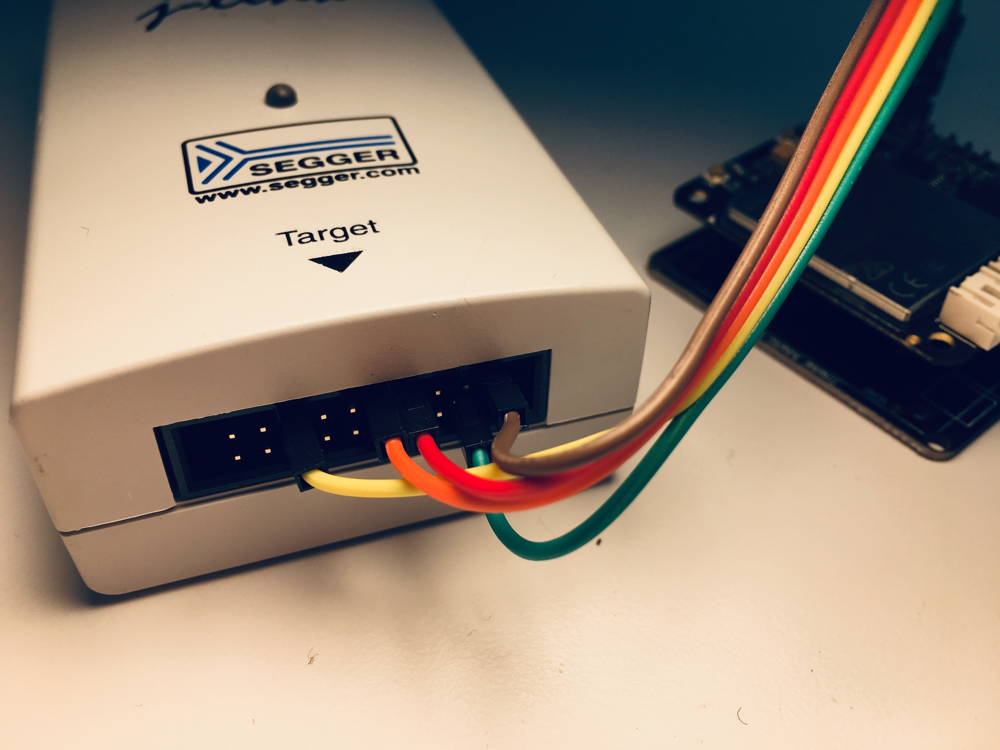
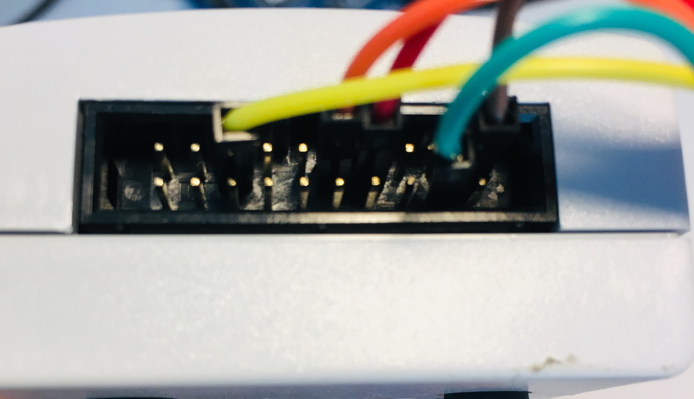

# Getting started with iTracker Blinky on mbed OS

This repo is derived from  [mbed-os-example-blinky](https://github.com/ARMmbed/mbed-os-example-blinky).

iTracker has a Nordic NRF52832 (NRF52_DK) nRF52832_xxAA

```
<VV> 	Flash (kB) 	RAM (kB)
AA      512         64
```

# iTracker References

[RAK Wireless RAK8212 iTracker](https://www.rakwireless.com/en/download/Cellular/RAK8212)

[iTracker GitHub](https://github.com/RAKWireless?utf8=%E2%9C%93&tab=repositories&q=itracker&type=&language=)

[Espurino iTracker](http://www.espruino.com/RAK8212)

<a name="hackster"></a> [Hackster iTracker](https://www.hackster.io/naresh-krish/getting-started-with-rak-itracker-module-and-arduino-ide-b78c0f)

### Now compile

Invoke `mbed compile`, and specify the name of your platform and your favorite toolchain (`GCC_ARM`, `ARM`, `IAR`).

```
mbed compile -m NRF52_DK -t GCC_ARM
```

Your PC may take a few minutes to compile your code. At the end, you see the following result:

```
[snip]
| Module             |           .text |       .data |          .bss |
|--------------------|-----------------|-------------|---------------|
| [fill]             |       274(+274) |     16(+16) |       57(+57) |
| [lib]/c.a          |   24207(+24207) | 2472(+2472) |       89(+89) |
| [lib]/gcc.a        |     3112(+3112) |       0(+0) |         0(+0) |
| [lib]/misc         |       208(+208) |     12(+12) |       28(+28) |
| [lib]/stdc++.a     |           1(+1) |       0(+0) |         0(+0) |
| main.o             |       461(+461) |       4(+4) |     281(+281) |
| mbed-os/components |         70(+70) |       0(+0) |         0(+0) |
| mbed-os/drivers    |     3819(+3819) |       0(+0) |         0(+0) |
| mbed-os/features   |   63016(+63016) |     12(+12) |   2090(+2090) |
| mbed-os/hal        |     1928(+1928) |       8(+8) |     130(+130) |
| mbed-os/platform   |     4978(+4978) |   260(+260) |   1933(+1933) |
| mbed-os/rtos       |     9716(+9716) |   168(+168) |   6113(+6113) |
| mbed-os/targets    |   14055(+14055) |     48(+48) |     759(+759) |
| Subtotals          | 125845(+125845) | 3000(+3000) | 11480(+11480) |
Total Static RAM memory (data + bss): 14480(+14480) bytes
Total Flash memory (text + data): 128845(+128845) bytes

Update Image: ./BUILD/NRF52_DK/GCC_ARM/mbed-os-example-blinky-itracker_update.bin
Image: ./BUILD/NRF52_DK/GCC_ARM/mbed-os-example-blinky-itracker.hex
```

### Program your board

There are a couple of options to program your board:

1. Using a NRF52_DK board with the single wire debugging (SWD) signals connected.
2. Using a [Segger JTAG](https://www.segger.com/products/debug-probes/j-link/)

#### Programming tools

See [software download links](#hackster) in Hackster site above

Programming iTracker using JLink application from the J-Link Software Pack.

```
JLinkExe -if swd -device nRF52832_xxAA -speed auto
connect
halt
loadfile ./BUILD/NRF52_DK/GCC_ARM/mbed-os-example-blinky-itracker.hex
reset
go
```

#### SWO Debug Connections


```
NRF52_DK | iTracker
-------------------
    GND <-> GND
    VTG <-> VCC
  SWDIO <-> SWDIO
 SWDCLK <-> SWDCLK
  RESET <-> RESET
```





