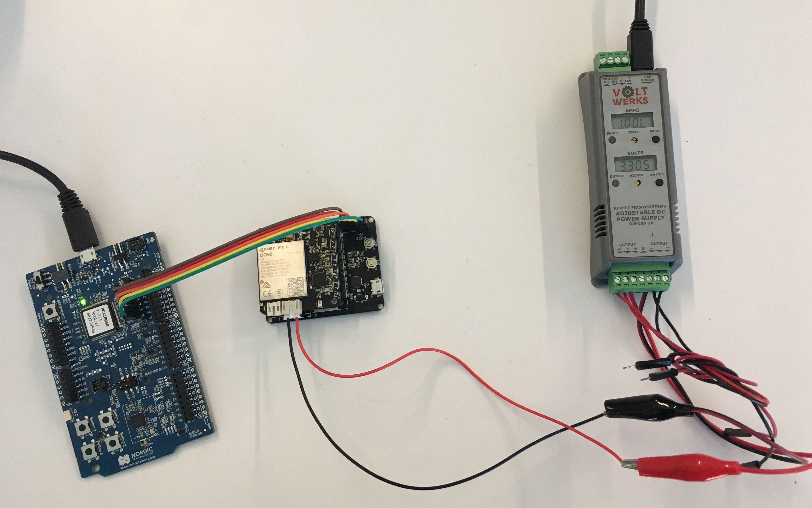
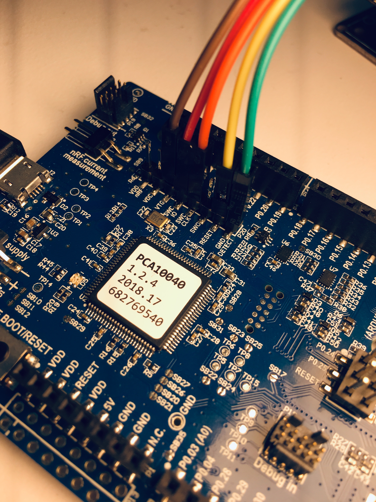

# Getting started with iTracker Blinky on mbed OS

This repo is derived from  [mbed-os-example-blinky](https://github.com/ARMmbed/mbed-os-example-blinky).

iTracker has a Nordic NRF52832 (NRF52_DK) nRF52832_xxAA

```
<VV> 	Flash (kB) 	RAM (kB)
AA      512         64
```

# iTracker References

[RAK Wireless RAK8212 iTracker](https://www.rakwireless.com/en/download/Cellular/RAK8212)

[iTracker GitHub](https://github.com/RAKWireless?utf8=%E2%9C%93&tab=repositories&q=itracker&type=&language=)

[Espurino iTracker](http://www.espruino.com/RAK8212)

<a name="hackster"></a> [Hackster iTracker](https://www.hackster.io/naresh-krish/getting-started-with-rak-itracker-module-and-arduino-ide-b78c0f)

### Now compile

Invoke `mbed compile`, and specify the name of your platform and your favorite toolchain (`GCC_ARM`, `ARM`, `IAR`).

```
mbed compile -m NRF52_DK -t GCC_ARM
```

Your PC may take a few minutes to compile your code. At the end, you see the following result:

```
[snip]
+----------------------------+-------+-------+------+
| Module                     | .text | .data | .bss |
+----------------------------+-------+-------+------+
| Misc                       | 13939 |    24 | 1372 |
| core/hal                   | 16993 |    96 |  296 |
| core/rtos                  |  7384 |    92 | 4204 |
| features/FEATURE_IPV4      |    80 |     0 |  176 |
| frameworks/greentea-client |  1830 |    60 |   44 |
| frameworks/utest           |  2392 |   512 |  292 |
| Subtotals                  | 42618 |   784 | 6384 |
+----------------------------+-------+-------+------+
Allocated Heap: unknown
Allocated Stack: unknown
Total Static RAM memory (data + bss): 7168 bytes
Total RAM memory (data + bss + heap + stack): 7168 bytes
Total Flash memory (text + data + misc): 43402 bytes
Image: build\K64F\ARM\mbed-os-example-blinky-itracker.hex
```

### Program your board

There are a couple of options to program your board:

1. Using a NRF52_DK board with the single wire debugging (SWD) signals connected.
2. Using a [Segger JTAG](https://www.segger.com/products/debug-probes/j-link/)

#### Programming tools

See [software download links](#hackster) in Hackster site above

Programming iTracker using JLink application from the J-Link Software Pack.

```
JLinkExe -if swd -device nRF52832_xxAA -speed auto
connect
halt
loadfile build\K64F\ARM\mbed-os-example-blinky-itracker.hex
reset
go
```

#### SWO Debug Connections



```
NRF52_DK | iTracker
-------------------
    GND <-> GND
    VTG <-> VCC
  SWDIO <-> SWDIO
 SWDCLK <-> SWDCLK
  RESET <-> RESET
```

